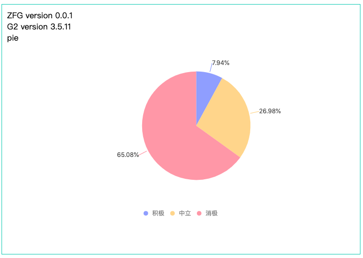
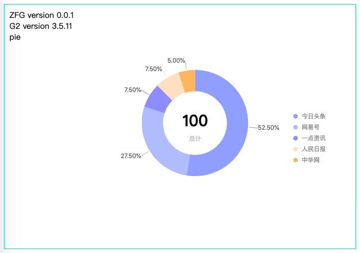

# ZFG

g2 react packaging version

## ✨ Example View




##  📦 Installation

```jsx
npm install --save zfg
```

## 🔨 Usage

```js
import React, { PureComponent } from 'react';
import { PIE } from 'zfg';

const data =  [{
  "id": null,
  "hot": null,
  "emotionType": 1,
  "category": null,
  "categoryType": null,
  "source": null,
  "title": null,
  "publishTime": null,
  "newsTags": null,
  "count": 5
}, {
  "id": null,
  "hot": null,
  "emotionType": 2,
  "category": null,
  "categoryType": null,
  "source": null,
  "title": null,
  "publishTime": null,
  "newsTags": null,
  "count": 17
}, {
  "id": null,
  "hot": null,
  "emotionType": 3,
  "category": null,
  "categoryType": null,
  "source": null,
  "title": null,
  "publishTime": null,
  "newsTags": null,
  "count": 41
}];

const dataConfig = {
  // 1. 数据 map 处理
  dictionaies: {
    emotionType: {
      1: '积极',
      2: '中立',
      3: '消极',
    },
  },
  /**
   * 2. 字段重命名
   * 饼形图、环形图，字段有两个 item*count
   * 如果数据字段不匹配，请配置完成
   */ 
  rename: {
    emotionType: 'item',
  },
}

const config = {
  width: 400,
  height: 400,
  forceFit: true,
  color: ['#8798ff', '#ffd481', '#ff90a2'],
  coord: {
    theta: {
      radius: 0.75,
    }
  },
}

export default class App extends PureComponent {

  render () {
    return (
      <div>
        <PIE data={data} dataConfig={dataConfig} config={config} />
      </div>
    )
  }
}
```

## API

## Development

```
npm install
npm start
```

## Example

http://localhost:8018/examples/pie.html

## Test
  ```js
  npm test
  
  npm run coverage
  ```

## License

zfg is released under the MIT license.
